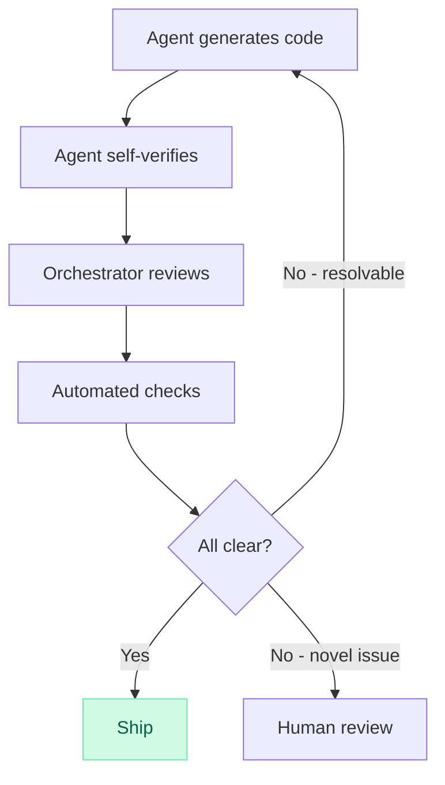

# sdlc-ded

ALL coding goes through here. Never hand-code — always delegate.
Uses the [coding-agent](https://github.com/openclaw/openclaw/blob/main/skills/coding-agent/SKILL.md) skill for running agents.

## The Loop

Inspired by [Boris Tane's SDLC collapse](https://boristane.com/blog/the-software-development-lifecycle-is-dead/).



1. **Scope** — write task brief
2. **Delegate** — spin up coding agent in isolated worktree
3. **Agent self-verifies** — edge cases, error handling, test coverage, runs verification
4. **Orchestrator reviews** — I read key diffs, check constraints, no scope creep
5. **Automated checks** — tests, lint, typecheck
6. **All clear → merge + notify user**
7. **Resolvable issue → respawn agent with fix prompt**
8. **Novel issue → escalate to user**

User only gets pulled in for novel issues.

## Task Brief

```markdown
## Task: <title>
**Goal:** one sentence
**Context:** key files/docs/APIs
**Constraints:** what NOT to do
**Done when:** verifiable success criteria
**Verify:** concrete commands
**Read first:** AGENTS.md
```

One sentence goal or split the task. Always include in prompt:
- Self-review before finishing: edge cases, error handling, test coverage
- Run verification commands before declaring done

## Delegation

Use `exec pty:true background:true` patterns from coding-agent.

- Isolate in worktree: `git worktree add -b <slug> ~/worktrees/<repo>/<slug>`
- Always append wake trigger to task prompt:
  `When finished, run: openclaw system event --text "Done: <summary>" --mode now`
- One task per agent. Don't mix setup and feature work.
- Agent fails → respawn with clearer prompt, don't take over.

### ⚠️ Stay available — never block on agents

After launching a background agent, **move on immediately**. Do not poll or wait.

1. `exec pty:true background:true` — fire and forget
2. System event wakes you when agent finishes
3. Then use `process:log` to read results and review
4. **Never use `process:poll` with long timeouts** — it blocks your turn and makes you unresponsive to the user
5. If the user asks for status, check `process:log` at that point

## Merge + Cleanup

```bash
cd ~/projects/<repo> && git merge <slug> && git push
git worktree remove ~/worktrees/<repo>/<slug>
git branch -d <slug>
```

## Report

```markdown
## Result
- Status: done | blocked | escalated
- Scope delivered:
- Files changed:
- Verification:
- Risks / follow-ups:
```
