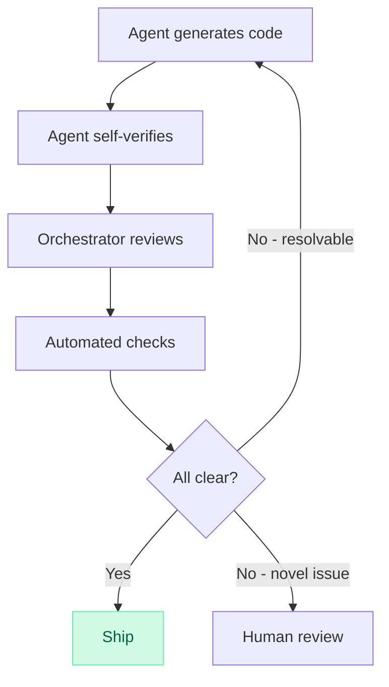

# sdlc-ded

ALL coding goes through here. Never hand-code — always delegate.
Uses the [coding-agent](https://github.com/openclaw/openclaw/blob/main/skills/coding-agent/SKILL.md) skill for running agents.

## The Loop

Inspired by [Boris Tane's SDLC collapse](https://boristane.com/blog/the-software-development-lifecycle-is-dead/).



1. **Scope** — write task brief
2. **Delegate** — spin up coding agent in isolated worktree
3. **Agent self-verifies** — edge cases, error handling, test coverage, runs verification
4. **Orchestrator reviews** — I read key diffs, check constraints, no scope creep
5. **Automated checks** — tests, lint, typecheck
6. **All clear → merge + notify user**
7. **Resolvable issue → respawn agent with fix prompt**
8. **Novel issue → escalate to user**

User only gets pulled in for novel issues.

## Task Brief

```markdown
## Task: <title>
**Goal:** one sentence
**Context:** key files/docs/APIs
**Constraints:** what NOT to do
**Done when:** verifiable success criteria
**Verify:** concrete commands (tests + real-data run)
**Read first:** AGENTS.md
```

One sentence goal or split the task. Always include in prompt:
- Self-review before finishing: edge cases, error handling, test coverage
- Run verification commands before declaring done
- **Run the actual thing with real data/APIs and verify outputs make sense** — passing tests is not enough

## Verification: Tests Are Not Enough

Green CI ≠ working software. The agent AND the orchestrator must verify with reality.

### Agent must (include in every prompt):
- Run the full test suite
- **Execute the program against real APIs/data** (dry-run mode if available)
- Check that outputs are sane: do numbers make sense? Are fields correct? Would a human look at this and say "yeah that's right"?

### Orchestrator must (before pushing/merging):
- **Dry-run with real data** and read the output
- Smell-test the results: are prices reasonable? Are dates correct? Do edge cases produce garbage?
- If something looks off, dig in before pushing — don't trust "tests pass"

A model that says ETH will hit $2,200 when it's at $1,900 in 3 hours is broken, no matter how many tests pass.

### API contract verification (include in prompt when there are external APIs):
- **Read the actual API docs** before implementing — don't guess field names, endpoints, or response shapes
- Cross-check implementation against docs: are we using the right fields? Right endpoints? Right response keys?
- If the API has a playground/explorer, hit it and verify the real response matches assumptions
- Invented/assumed identifiers (tickers, enum values, field names) are a top source of silent failures — verify every one against real API responses

## Delegation

Use `exec pty:true background:true` patterns from coding-agent.

- Isolate in worktree: `git worktree add -b <slug> ~/worktrees/<repo>/<slug>`
- Always append wake trigger to task prompt:
  `When finished, run: openclaw system event --text "Done: <summary>" --mode now`
- One task per agent. Don't mix setup and feature work.
- Agent fails → respawn with clearer prompt, don't take over.

### ⚠️ Stay available — never block on agents

After launching a background agent, **move on immediately**. Do not poll or wait.

1. `exec pty:true background:true` — fire and forget
2. System event wakes you when agent finishes
3. Then use `process:log` to read results and review
4. **Never use `process:poll` with long timeouts** — it blocks your turn and makes you unresponsive to the user
5. If the user asks for status, check `process:log` at that point

## Merge + Cleanup

```bash
cd ~/projects/<repo> && git merge <slug> && git push
git worktree remove ~/worktrees/<repo>/<slug>
git branch -d <slug>
```

## Report

```markdown
## Result
- Status: done | blocked | escalated
- Scope delivered:
- Files changed:
- Verification:
- Risks / follow-ups:
```

### ⚠️ Tool choice is sacred

When the user specifies which tool to use (Claude Code, Codex, etc.), **that is the tool. Period.**

- If the specified tool fails → **fix the invocation** (flags, env, working dir). Do NOT silently swap to a different tool.
- If you can't figure out the correct invocation → **ask the user**. Do NOT substitute.
- If the tool genuinely can't do the job → **tell the user** and ask what they want to do.
- Never rationalize a swap ("it's faster", "it already failed"). The user chose deliberately.

### ⚠️ Don't merge without permission

- Default: **push branch + create PR**. Let the user review/merge.
- Only merge directly if the user explicitly says "ship it" or "merge it".
- Never merge and then ask. Always ask and then merge.
- If a previous task was merged directly, that doesn't mean the next one should be too.

### Tool reference: Codex CLI

\`\`\`bash
# Non-interactive (full auto, no approval prompts):
codex exec --full-auto "<prompt>"

# With explicit writable paths:
codex exec --full-auto -w . "<prompt>"
\`\`\`

### Tool reference: Claude Code

\`\`\`bash
# Non-interactive (skip permission prompts):
claude --dangerously-skip-permissions -p "<prompt>"
\`\`\`
